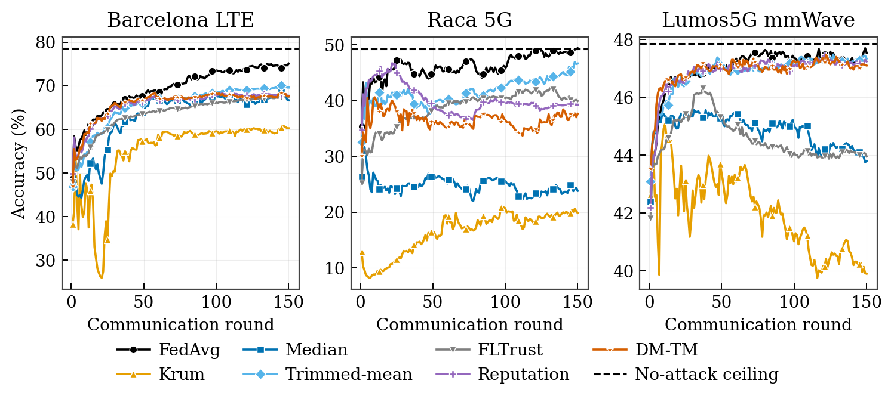
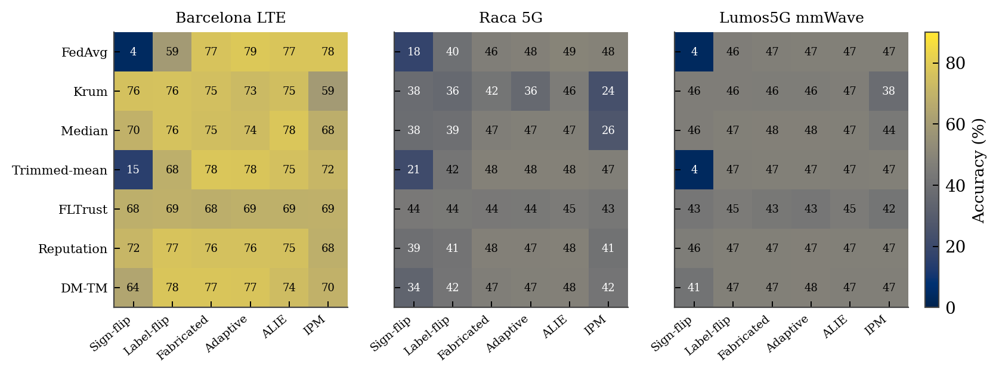

# oran-fed-robust

### Which robust aggregation rule should you trust in Open-RAN? An empirical study of federated poisoning defenses on real base-station traffic.


A reproducible benchmark that evaluates seven federated-learning aggregation rules — **FedAvg, Krum, coordinate-wise median, trimmed-mean, FLTrust, a history-aware reputation rule, and our proposed Direction-and-Magnitude Trimmed Mean (DM-TM)** — against six poisoning attacks, on **three independent real cellular datasets**. Every number in the accompanying study is measured on real network traffic, with multi-seed 95% confidence intervals.

---

## TL;DR — the finding

> On real Open-RAN-style control traffic, the aggregation rules most associated with robustness are **not** the safest. Under the collusion-aware **Inner-Product-Manipulation (IPM)** attack, **Krum and coordinate-median degrade the most — below undefended FedAvg** — while **trimmed-mean and FLTrust stay stable**, and our proposed **DM-TM closes the IPM gap while preserving sign-flip robustness without a clean server dataset**. No single rule wins across all attacks; the *attack model*, not the rule, dominates the outcome. This replicates across three independent networks.

<p align="center">
  
</p>
<p align="center"><em>Per-round training accuracy under the IPM attack on three real networks. Krum (amber) and median (blue) degrade over rounds as the attack accumulates, drifting below the no-attack ceiling, while FedAvg and trimmed-mean hold.</em></p>

<p align="center">
  
</p>
<p align="center"><em>The same failure pattern recurs on all three real networks: FedAvg and trimmed-mean fail under sign-flipping, Krum fails under IPM (dark cells = low accuracy).</em></p>

---

## Datasets (all real, all public)

| Dataset | Network | Where | Task |
|---|---|---|---|
| **Barcelona LTE** | 4G base stations | Spain | Downlink-load regime (5-class) |
| **Raca 5G** | Commercial 5G client traces | Ireland | Throughput regime (5-class) |
| **Lumos5G** | Commercial mmWave 5G | USA | Throughput regime (5-class) |

Non-IID heterogeneity is **genuine** — it comes from real differences across base stations, cells, times, mobility, and applications, not from synthetic Dirichlet partitioning. The datasets are third-party and are **not** redistributed here; fetch them with one command.

## Attacks & defenses

- **Attacks:** sign-flip, label-flip, fabricated-update injection, a stealthy intermittent adversary, and the collusion-aware **ALIE** and **IPM** attacks.
- **Aggregators:** FedAvg, Krum, coordinate-wise median, trimmed-mean, FLTrust, a magnitude-clipped reputation rule, and **DM-TM (Direction-and-Magnitude Trimmed Mean)** — all behind one interface (`build_aggregator`).

## Quick start

```bash
python -m venv .venv && source .venv/bin/activate     # Windows: .venv\Scripts\activate
pip install -e ".[dev]"
python scripts/get_real_data.py                       # fetch all three real datasets

# full measured grid on a real dataset (multi-seed, 95% CIs)
PYTHONPATH=src python scripts/run_full_benchmark.py --dataset barcelona --out results_real
PYTHONPATH=src python scripts/run_full_benchmark.py --dataset fiveg    --seeds 3 --rounds 150 --out results_5g
PYTHONPATH=src python scripts/run_full_benchmark.py --dataset lumos5g  --seeds 3 --rounds 150 --out results_lumos

# regenerate the publication-quality figures
PYTHONPATH=src python scripts/make_figures.py

# tests + aggregation API
PYTHONPATH=src pytest
PYTHONPATH=src uvicorn oran_fed_robust.api.app:app --port 8000
```

## Repository layout

```
src/oran_fed_robust/
├── data/          synthetic generator + three real-dataset loaders
├── models/        NumPy multinomial-logistic control model
├── attacks/       6 poisoning attacks (incl. collusion-aware ALIE/IPM)
├── aggregation/   6 aggregation rules behind one interface
├── training/      federated round orchestration
├── evaluation/    accuracy / macro-F1
└── api/           FastAPI near-RT-RIC-style aggregation service
scripts/           data fetch, full benchmark, figure + table generation
tests/             17 unit / smoke / API tests
```

## Reproducibility

Every table and figure is produced by the released code from the released configs and seeds. There are no placeholder or simulated numbers. To reproduce the headline figure end-to-end: `get_real_data.py` → three `run_full_benchmark.py` runs → `make_figures.py`.

## Extending to your own O-RAN data

Implement a loader that yields `ClientDataset(client_id, x, y)` per base station from your OpenRAN Gym / ns-O-RAN E2 KPM exports (see `data/real_traffic.py` for a worked example) and pass the list to `FederatedTrainer`. Nothing else changes.

## License

[MIT](LICENSE).
